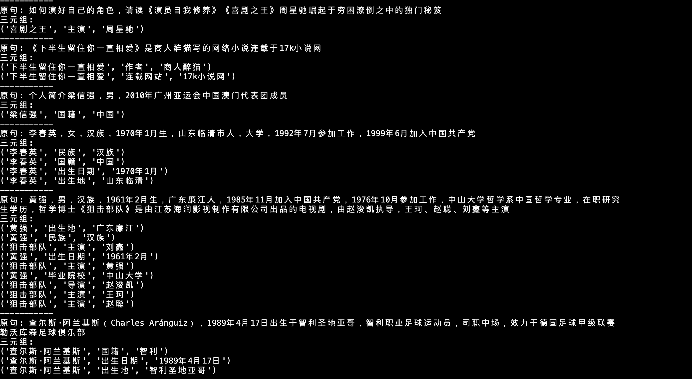

# 使用pyhanlp提取文本中的三元组

修改自[基于DGCNN和概率图的轻量级信息抽取模型](https://kexue.fm/archives/6671#%E6%A0%B7%E6%9C%AC%E7%89%B9%E7%82%B9) 

代码：[https://github.com/bojone/kg-2019](https://github.com/bojone/kg-2019)

原项目是python2环境，并且模型需要自行训练。修改后的项目支持python3环境运行，并且带有训练好的模型文件，可直接运行。

```
@misc{
  jianlin2019bdkgf,
  title={A Hierarchical Relation Extraction Model with Pointer-Tagging Hybrid Structure},
  author={Jianlin Su},
  year={2019},
  publisher={GitHub},
  howpublished={\url{https://github.com/bojone/kg-2019}},
}
```

## 运行环境

- JRE
- python3

## 词向量模型

词向量：https://pan.baidu.com/s/1YYE2T3f-lPyLBrJuUowAsA，密码:5p0h

## 数据集下载地址

- [train_data.json](https://dataset-bj.cdn.bcebos.com/sked/train_data.json)
- [dev_data.json](https://dataset-bj.cdn.bcebos.com/sked/dev_data.json)
- [all_50_schemas](https://dataset-bj.cdn.bcebos.com/sked/all_50_schemas)

## 效果:

|Precision|Recall|F1|
|:-:|:-:|:-:|
|0.8939	| 0.8679 | 0.8807| 



## 使用方式

- 下载数据集，放置在`config.py`中`DATASET_DIR`对应的目录下
- 下载word2vec数据集，放置在`config.py`中`w2v_model_path`对应的路径位置

```
pip3 install requirements.txt
```

### 模型训练

```
python3 train.py
```

### 预测结果

```
python3 predict.py
```


